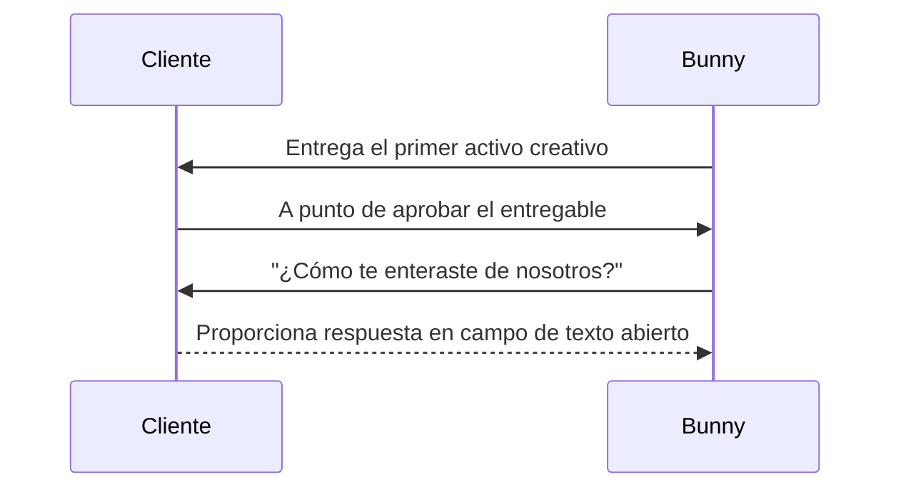

import { Callout, Steps, Step } from "nextra-theme-docs";

# 1. Haz la Pregunta

El primer paso en el Marco de Canales de Adquisición es preguntar automáticamente a los nuevos usuarios: "¿Cómo te enteraste de nosotros?". Este paso es crucial para recopilar datos precisos sobre cómo tus clientes inicialmente se enteraron de tu producto o servicio.

<Steps>
### Paso 1: Elige el Momento Adecuado

Para aumentar la probabilidad de que los usuarios respondan, haz la pregunta en un momento en el que hayan completado una interacción principal con tu producto o servicio. Por ejemplo, podrías hacer la pregunta:

- Después de que un usuario complete una compra
- Después de que un usuario se registre o suscriba
- Cuando un usuario esté a punto de aprobar su primer entregable (como en el caso de Bunny Inc.)

Hacer la pregunta en estos momentos reduce la fricción y aumenta las posibilidades de obtener una respuesta.

### Paso 2: Reduce la Fricción y el Sesgo

Para obtener respuestas imparciales y diversas, se recomienda altamente usar un campo de texto abierto en lugar de proporcionar opciones predefinidas. Limitar a los usuarios a un conjunto de opciones puede sesgar sus respuestas y prevenir que aprendas sobre nuevos canales de adquisición inesperados.

</Steps>

Al usar un campo de texto abierto, permites que los usuarios se expresen libremente, revelando potencialmente canales de adquisición o referentes que no habías considerado previamente. Por ejemplo, en Bunny Inc., el equipo descubrió que un conferencista brasileño del que no tenían conocimiento estaba invitando a cientos de asistentes a la conferencia a usar su servicio, una oportunidad en el mercado brasileño que nunca habían contemplado.

<Callout emoji="⚠️">
Aunque usar un campo de texto abierto requiere normalización manual de las respuestas (cubierto en [Paso 2](/acquisition-channels-framework/normalize-responses)), las percepciones ganadas valen bien el esfuerzo.
</Callout>

### Reduciendo la Fricción

Para reducir aún más la fricción y aumentar las tasas de respuesta, haz la pregunta opcional. No querrás forzar a los usuarios a proporcionar una respuesta, ya que esto podría llevar a la frustración y abandono de interacciones.

Adicionalmente, considera integrar la pregunta directamente en tu experiencia de producto en lugar de depender únicamente del correo electrónico. Las indicaciones dentro del producto tienden a tener tasas de respuesta más altas.

### Ejemplos

En Bunny Inc., donde se venden servicios creativos para aplicaciones críticas, la pregunta se hace cuando los clientes reciben su primer entregable y están a punto de aprobarlo.

En Torre, una plataforma de emparejamiento de talento, a los buscadores de empleo y freelancers se les hace la pregunta inmediatamente después de publicar una oferta de trabajo o una oportunidad freelance.
<Callout emoji="💡">
Al integrar la pregunta en tu experiencia de producto central, no solo aumentas las tasas de respuesta, sino que también demuestras un compromiso con entender los viajes de tus clientes.
</Callout>
