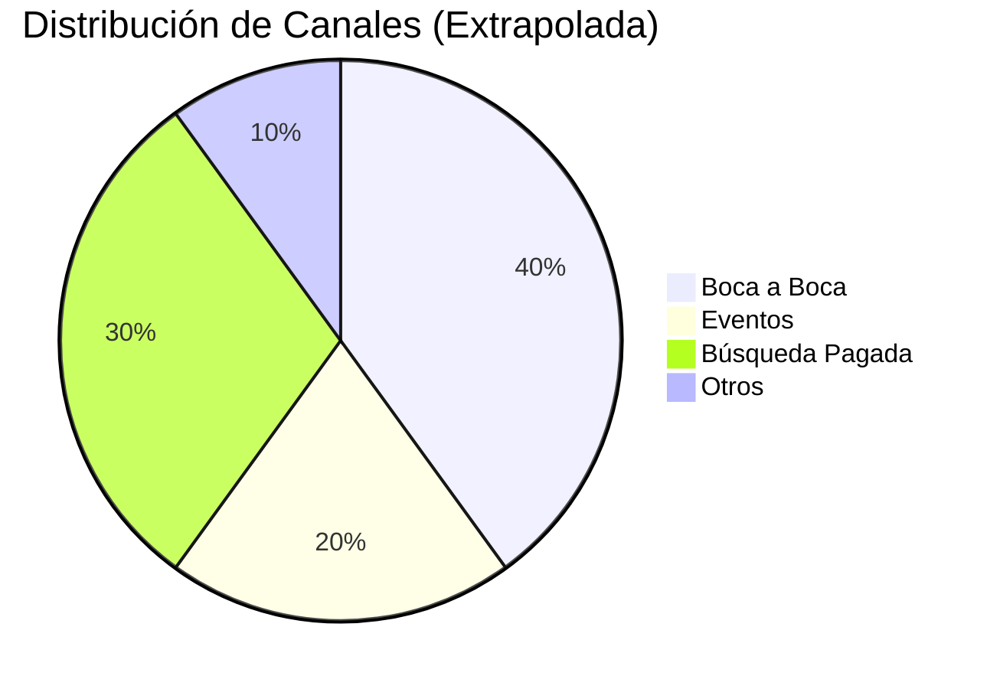

import { Callout, Steps, Step } from "nextra-theme-docs";

# 3. Extrapolación

Por supuesto, no todos los clientes responderán a la pregunta "¿Cómo te enteraste de nosotros?". Algunos pueden optar por omitirla, otros pueden no recordar y algunas respuestas como "en línea" o "internet" son demasiado vagas para ser útiles.

En nuestra experiencia, alrededor de un cuarto de los clientes tienden a proporcionar una respuesta clara y categorizable. Si tienes un volumen suficiente, estos datos deberían ser representativos de tu base de clientes en general. Por lo tanto, es seguro extrapolar los datos normalizados de los canales de adquisición a toda tu base de clientes.

<Callout emoji="⚠️">
La extrapolación solo debe hacerse cuando tienes un tamaño de muestra estadísticamente significativo. Como regla general, apunta a tener al menos 100 respuestas antes de extrapolar.
</Callout>

Aquí hay un ejemplo simple para ilustrar la extrapolación:

Digamos que recibiste 1,000 nuevos clientes el mes pasado. De esos, 250 respondieron a la pregunta del canal de adquisición, y sus respuestas se normalizaron de la siguiente manera:

- Boca a Boca: 100 clientes
- Eventos: 50 clientes
- Búsqueda Pagada: 75 clientes
- Otros: 25 clientes

Para extrapolar, asumirías que la distribución de canales de adquisición para los 750 clientes restantes (que no respondieron) es la misma que para los 250 que sí respondieron.

La distribución extrapolada sería:

Boca a Boca: 400 clientes (100 / 250 * 1000)
Eventos: 200 clientes (50 / 250 * 1000)
Búsqueda Pagada: 300 clientes (75 / 250 * 1000)
Otros: 100 clientes (25 / 250 * 1000)
Aunque no es perfecta, esta extrapolación te da una imagen mucho más precisa de tus verdaderos canales de adquisición que confiar únicamente en los datos de análisis web.

<Callout emoji="💡">
Para una mayor precisión, puedes extrapolar basándote en segmentos de clientes (por ejemplo, por producto, nivel de precios, geografía) si tienes un volumen de respuesta suficiente para cada segmento.
</Callout>
Con estos datos extrapolados, ahora puedes analizar el rendimiento e impacto de cada canal de adquisición con mayor confianza.