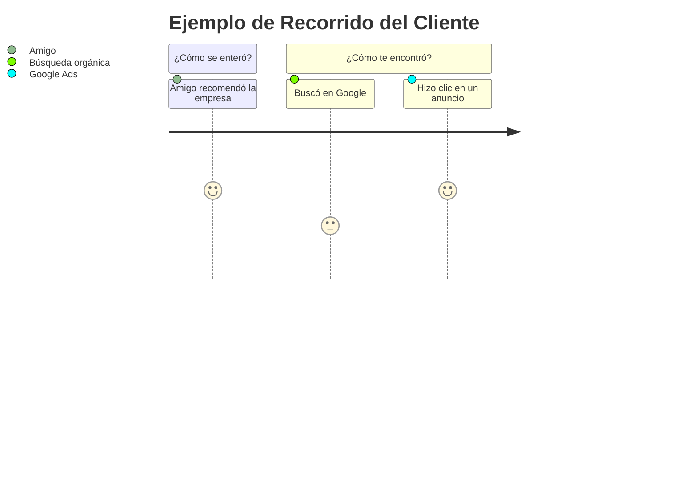

import { Callout, Steps, Step } from "nextra-theme-docs";

# La Diferencia Entre 'Cómo Te Encontraron los Clientes' y 'Cómo Se Enteraron de Ti'

Cuando intentas comprender tus canales de adquisición de clientes, es crucial distinguir entre dos preguntas distintas pero relacionadas:

1. **¿Cómo te encontraron los clientes?**
2. **¿Cómo se enteraron de ti inicialmente?**

<Callout>
La primera pregunta se refiere al canal específico a través del cual los clientes llegaron a tu sitio web o aplicación. La segunda pregunta se enfoca en cómo obtuvieron conocimiento de tu existencia en primer lugar.
</Callout>

Por ejemplo, digamos que un cliente busca "servicios de diseño de logotipos" en Google. Ven tu anuncio de Google Ads y hacen clic para visitar tu sitio web. En este caso:

- El canal a través del cual **te encontraron** fue Google Ads.
- Pero el canal a través del cual **se enteraron de ti inicialmente** podría haber sido la recomendación de un amigo, un artículo de blog que mencionó tu empresa o tal vez solo vieron tu anuncio de Google Ads mientras buscaban servicios de diseño.

<Callout emoji="💡">
Comprender esta distinción es clave porque los clientes a menudo se enteran de ti a través de un canal (como el boca a boca) pero te encuentran a través de un canal completamente diferente (como una búsqueda en Google).
</Callout>

He aquí un ejemplo más claro:

En este diagrama, los clientes **se enteraron** de tu empresa a través de una recomendación de un amigo. Pero algunos **te encontraron** a través de búsquedas orgánicas en Google, mientras que otros **te encontraron** haciendo clic en uno de tus anuncios de Google Ads.

<Steps>

### Paso 1
Pregunta a tus nuevos usuarios: "¿Cómo te enteraste de nosotros?". Esta pregunta apunta a descubrir el canal a través del cual obtuvieron conocimiento de tu empresa por primera vez.

### Paso 2 
Luego pregunta: "¿Cómo nos encontraste hoy?". Esta pregunta apunta al canal específico a través del cual llegaron a tu sitio web o aplicación en esta ocasión.

</Steps>

Al comprender ambas respuestas, obtendrás una imagen mucho más clara de tu recorrido completo de adquisición de clientes y podrás optimizar mejor tus estrategias de marketing y adquisición.

Algunas empresas ignoran la primera pregunta, lo que les impide comprender completamente su ciclo de adquisición de clientes. Otras empresas solo preguntan la primera pregunta, lo que las deja sin los datos valiosos de los canales específicos a través de los cuales los clientes los encuentran.

Para un análisis completo, necesitas conocer [ambas respuestas](/introduccion).