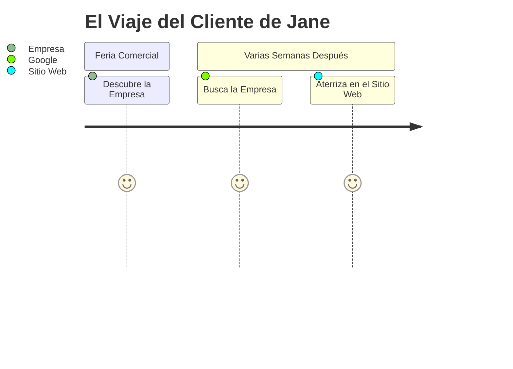

import { Callout, Steps, Step } from "nextra-theme-docs";

# Las Desventajas de Confiar Únicamente en Herramientas de Análisis Web

Mientras que herramientas de análisis web como Google Analytics son invaluables para entender cómo los usuarios interactúan con tu sitio web o aplicación, presentan limitaciones a la hora de medir con precisión los canales de adquisición de clientes. Aquí explicamos el porqué:

<Callout emoji="⚠️">
Las herramientas de análisis web capturan principalmente cómo los usuarios *encontraron* tu sitio web o aplicación, no necesariamente cómo *aprendieron sobre* tu empresa inicialmente.
</Callout>

Considera este escenario: Jane asiste a una feria comercial donde tienes un stand. Ella ve tu oferta y toma nota mentalmente. Semanas más tarde, cuando quiere aprender más sobre tu producto, no recuerda el nombre de dominio de tu empresa. Como la mayoría, abre su navegador, escribe el nombre de tu empresa o producto, y Google muestra tu sitio web como el resultado principal. Jane hace clic en él.

Si le preguntaras a Jane, "¿Cómo encontraste nuestro sitio web?", ella podría decir, "Google". Pero si preguntaras, "¿Cómo te enteraste por primera vez de nosotros?", su respuesta probablemente sería, "En una feria comercial".

Esta distinción es crucial para medir con precisión los canales de adquisición. Si dependes exclusivamente de Google Analytics, Jane sería asignada al canal "Google", aun cuando fue en la feria comercial donde ella inicialmente descubrió tu empresa.

<Callout emoji="💡">
Atribuir incorrectamente a los clientes a canales puede llevar a inversiones desorientadas en marketing y a análisis de rendimiento distorsionados.
</Callout>

Por ejemplo, si inviertes en publicidad pagada en Google, podrías estar asignando erróneamente ingresos y clientes a esos esfuerzos, especialmente si pujas por palabras clave que incluyen el nombre de tu marca.

Para ilustrar aún más, desglosemos el viaje del cliente de Jane:

Mientras Google Analytics atribuiría a Jane al canal "Google", la atribución más precisa sería el canal "Feria Comercial", donde ella se enteró por primera vez de tu empresa.

<Callout emoji="🔑">
Medir con precisión los canales de adquisición es crucial para optimizar tus esfuerzos de marketing y la asignación de inversiones.
</Callout>
Para abordar este desafío, necesitas un enfoque sistemático que vaya más allá de confiar solamente en herramientas de análisis web. Aquí es donde el Marco de Canales de Adquisición entra en juego, proporcionando una solución integral para identificar y analizar tus canales de adquisición de clientes de manera efectiva.