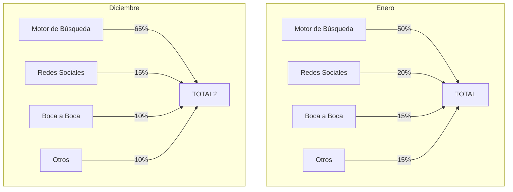

import { Callout, Steps, Step } from "nextra-theme-docs";

# 4. Analiza

Ahora que tienes una imagen más completa de cómo tus nuevos usuarios descubrieron tu producto, es hora de analizar los datos. Examinar los canales de adquisición es invaluable para cualquier estrategia de mercadeo y crecimiento, ya que te permite optimizar tus esfuerzos y recursos en las áreas más fructíferas.

<Callout>
El análisis de los canales de adquisición es un componente esencial de un enfoque impulsado por datos para la comercialización y el crecimiento. Te ayuda a tomar decisiones basadas en evidencia en lugar de conjeturas.
</Callout>

## Sigue las tendencias

Lo primero que debes hacer es observar las tendencias a lo largo del tiempo. ¿Están creciendo o disminuyendo ciertos canales? ¿Hay cambios estacionales o cíclicos? Trazar estos patrones te ayudará a anticipar y planificar más efectivamente.

Por ejemplo, es posible que notes un pico anual en las referencias de motores de búsqueda a medida que más personas investigan tu espacio durante una temporada de vacaciones o un evento importante. O tal vez veas un aumento constante en las remisiones virales a medida que crece tu base de usuarios existentes.

## Cruza referencias con tus KPIs

Además de patrones generales, busca correlaciones entre los canales de adquisición y tus principales indicadores de rendimiento (KPIs) como ingresos, conversión y retención.

- ¿Los usuarios que provienen de ciertos canales son más valiosos a largo plazo?
- ¿Algunos canales atraen usuarios más propensos a convertirse en clientes pagados?
- ¿Hay canales que impulsan una mayor retención y uso repetido?

Identificar estas conexiones te ayudará a priorizar tus esfuerzos en los canales que alimentan tu negocio.

Por ejemplo, podrías descubrir que los usuarios que ingresan a través de campañas de referencia tienen tasas de conversión 2x más altas. O que las personas que encuentran tu producto a través de influencers tienen un valor de vida útil (LTV) significativamente mayor.

<Steps>

### Paso 1
Une tus datos de canales de adquisición con tus sistemas de seguimiento de clientes y analítica de productos.

### Paso 2 
Crea una tabla cruzada para visualizar métricas clave como LTV, tasa de conversión y retención por canal de adquisición.

### Paso 3
Identifica los canales sobresalientes en cada métrica y replantea tus esfuerzos de adquisición en consecuencia.

</Steps>

## Integra analítica web

Aunque el marco de canales de adquisición te da una visión más completa de cómo tus nuevos usuarios encuentran tu producto, las herramientas de analítica web como Google Analytics todavía pueden proporcionar información valiosa.

Los datos de analítica web son especialmente útiles para entender cómo los usuarios interactúan con tu sitio web y cuáles son sus puntos de entrada. Combina esta información con tus datos de canales de adquisición para una imagen más completa.

Por ejemplo, podrías descubrir que la mayoría de los usuarios que llegan a través de búsquedas orgánicas aterrizan en tu página de precios, mientras que los usuarios referidos tienden a aterrizar en tu página de inicio. Esto podría influir en cómo optimizas esas páginas de aterrizaje.

O puedes notar que ciertos canales tienen una tasa de rebote más alta que otros, lo que indica una desconexión entre las expectativas del usuario y tu producto. Esto podría sugerir la necesidad de ajustar tu posicionamiento o el mensaje.

No ignores las poderosas herramientas de análisis web a tu disposición. [Intégralas con tus datos de canales de adquisición](/marco-de-canales-de-adquisicion/haz-la-pregunta) para obtener una mejor comprensión holística.