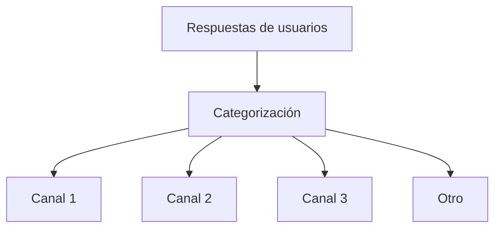

import { Callout, Steps, Step } from "nextra-theme-docs";

# 2. Normaliza las Respuestas

Las respuestas de los usuarios sobre cómo se enteraron de tu producto o servicio pueden ser muy variadas y confusas. Para analizar los datos de manera efectiva, es necesario normalizar y categorizar las respuestas en grupos estándar de canales de adquisición.

<Steps>
### Paso 1: Define tus Categorías de Canales

Determina las categorías de canales de adquisición que sean relevantes para tu negocio. Algunas categorías comunes incluyen:

- Búsqueda orgánica
- Publicidad pagada
- Referencias (boca a boca)
- Redes sociales
- Contenido de marketing
- Eventos
- Otros

Asegúrate de definir claramente cada categoría para que puedas categorizar las respuestas de manera consistente.

### Paso 2: Entrena a tu Equipo

Entrena a las personas que estarán categorizando las respuestas sobre cómo aplicar las definiciones de las categorías de manera consistente. Proporciona ejemplos de respuestas de usuarios y cómo deben categorizarse.

### Paso 3: Categoriza las Respuestas

A medida que recibes respuestas de los usuarios, categorízalas en las categorías de canales de adquisición definidas. Es posible que algunas respuestas no encajen perfectamente en una categoría. En esos casos, usa tu mejor criterio o crea una nueva categoría de "Otro" para esas respuestas.

### Paso 4: Revisa y Refina Periódicamente

Revisa las categorías y las respuestas categorizadas periódicamente para garantizar la coherencia. Ajusta las definiciones de las categorías o combina/divide categorías según sea necesario.
</Steps>

<Callout emoji="⚠️">
La normalización de las respuestas es un proceso iterativo. A medida que obtengas más datos, es posible que debas ajustar tus categorías de canales para obtener información más precisa.
</Callout>

Al normalizar las respuestas de los usuarios en categorías de canales de adquisición estándar, podrás analizar con mayor precisión de dónde provienen tus usuarios y tomar decisiones informadas sobre tus estrategias de marketing y adquisición.

Para ver un ejemplo de cómo extrapolamos estos datos a toda la base de usuarios, consulta la siguiente sección: [Extrapola](/marco-de-canales-de-adquisicion/extrapola).