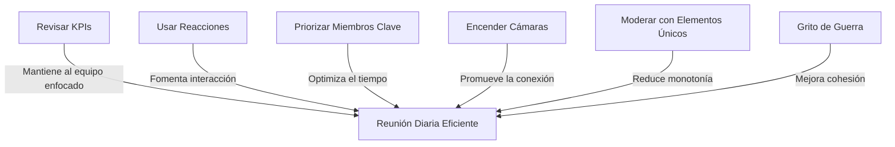

import { Callout, Steps, Step } from "nextra-theme-docs";

# Consejos para las Reuniones Diarias

Las reuniones diarias son una parte crucial de Estandap, y hay varias maneras de optimizarlas para maximizar su eficiencia y valor. Aquí hay algunos consejos avanzados para sacar el máximo provecho de estas reuniones:

### Revisar KPIs

<Callout>
Si tu equipo es impulsado por datos, podrías agregar unos minutos a la reunión diaria para revisar y reflexionar sobre tus indicadores clave de rendimiento (KPI) diarios. Esto ayudará a mantener a todo el equipo alineado con los objetivos y métricas clave.
</Callout>

Por ejemplo, si estás trabajando en un proyecto de marketing digital, podrías revisar rápidamente métricas como impresiones de anuncios, clicks, conversiones y costo por adquisición. Discutir estas métricas puede ayudar a identificar rápidamente áreas que requieren atención o ajustes.

### Usar Reacciones

<Steps>

### Paso 1
A medida que lees las actualizaciones diarias de tus compañeros de equipo, reacciona con emojis como ✅ para indicar que has leído y comprendido la actualización. 

### Paso 2
También puedes reaccionar con otros emoticonos como 👏 o ❤️ para animar o mostrar apoyo a tus compañeros de equipo.

</Steps>

Las reacciones son una excelente manera de fomentar la interacción y el compromiso durante la parte de lectura de la reunión diaria. Además, ayudan a mantener un registro visual de quién ha leído qué actualización.

### Priorizar Miembros Clave

Si tu equipo es grande, concéntrate primero en leer las actualizaciones de otros miembros del equipo de los que puedas depender directamente o viceversa. Por ejemplo, si eres un diseñador, asegúrate de leer primero las actualizaciones de los desarrolladores con los que trabajas más estrechamente.

En equipos muy grandes, los líderes pueden tener que comenzar a leer las actualizaciones con anticipación para poder leerlas todas durante la reunión.

### Encender Cámaras

<Callout>
Si te reúnes de forma remota, enciende tus cámaras durante la discusión de temas. La interacción cara a cara es importante, y la reunión diaria puede ser la única vez del día cuando todos los miembros del equipo puedan verse unos a otros.
</Callout>

Puedes apagar tus cámaras mientras lees las actualizaciones para evitar distracciones, pero asegúrate de encenderlas nuevamente cuando sea momento de participar en las discusiones.

### Moderar con Elementos Únicos

Para reducir la monotonía y aumentar el compromiso, haz que el moderador comparta algo único o divertido durante el transcurso de la reunión. Esto podría ser:

- Una cita inspiradora
- Un chiste o meme relacionado con el trabajo
- Una pregunta de trivia para el equipo
- Una celebración de cumpleaños o logro de un miembro del equipo

Estos pequeños toques pueden hacer que las reuniones diarias sean más amenas y memorables.

### Terminar con un Grito de Guerra

<Callout>
Termina la reunión con un grito de guerra o celebración en equipo. Según un [estudio](/consejos-avanzados/consejos-reuniones-diarias#estudios-de-gritos-de-guerra), esto puede ayudar a que tu equipo rinda mejor, mejore las funciones cognitivas e incluso se guste más entre sí.
</Callout>

Algunos ejemplos de gritos de guerra pueden ser:

- "¡Vamos equipo!" seguido de un aplauso 
- Una palabra o frase motivadora que represente los valores de tu equipo
- Hacer un "¡Sí!" o "¡Ajá!" al unísono

Estos pequeños rituales pueden parecer triviales, pero pueden tener un gran impacto en la moral y la cohesión del equipo.

Al seguir estos consejos, podrás llevar tus reuniones diarias de Estandap al siguiente nivel, maximizando la eficiencia, el compromiso y la colaboración en tu equipo.