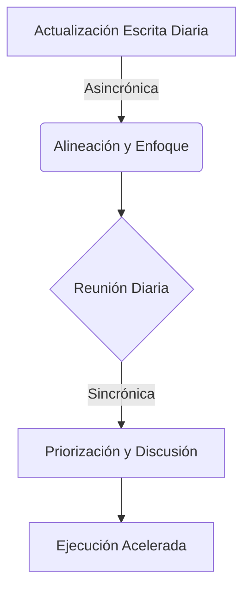

import { Callout, Steps, Step } from "nextra-theme-docs";

# Introducción a Estandap

Estandap es una plantilla innovadora para reuniones diarias ágiles diseñada para equipos remotos y distribuidos. Combina de manera eficiente la comunicación sincrónica y asincrónica, maximizando la productividad y el valor generado en las interacciones diarias del equipo.

<Callout>
Las metodologías de gestión ágil promueven reuniones diarias de equipo donde los miembros pueden hacer compromisos, identificar y discutir posibles desafíos, así como resolver problemas complicados. Sin embargo, los standups tradicionales, diseñados para un mundo presencial, a menudo resultan en actualizaciones improvisadas, desajustes contextuales y reuniones que exceden el tiempo previsto.
</Callout>

Estandap aborda estos desafíos al combinar lo mejor de la comunicación sincrónica y asincrónica, adaptándose al mundo remoto y aprovechando las herramientas disponibles. Ha sido desarrollado y perfeccionado durante más de una década por Alexander Torrenegra, emprendedor y fundador de empresas como Voice123, Bunny Studio, Torre y Tribe.

La estructura de Estandap consta de dos partes fundamentales:

1. [Una actualización escrita diaria asincrónica](/objetivo-principal-estandap/actualizacion-escrita-diaria)
2. [Una reunión diaria sincrónica (simultánea)](/objetivo-principal-estandap/reunion-diaria)

<Steps>

### Paso 1
Antes de la reunión diaria, cada miembro del equipo responde preguntas clave en un documento compartido o canal, cubriendo logros, obstáculos, metas planificadas y objetivos principales. Esto promueve la alineación, la priorización y el enfoque en resultados.

### Paso 2 
Durante la reunión diaria, el equipo lee las actualizaciones escritas, lista y prioriza los temas que necesitan ser discutidos, y luego los aborda de manera eficiente. Esto maximiza el valor de las interacciones sincrónicas y evita el desperdicio de tiempo.

</Steps>

Estandap ha sido diseñado para facilitar que los miembros del equipo en empresas de diversos tamaños permanezcan alineados, prioricen, se empaticen entre sí, ayuden a eliminar obstáculos y aceleren la ejecución exitosa.

Al combinar los beneficios de la comunicación asincrónica y sincrónica, Estandap maximiza la eficiencia y el valor de las reuniones diarias, permitiendo a los equipos ágiles y remotos mantenerse en sincronía y alcanzar sus objetivos de manera más efectiva.