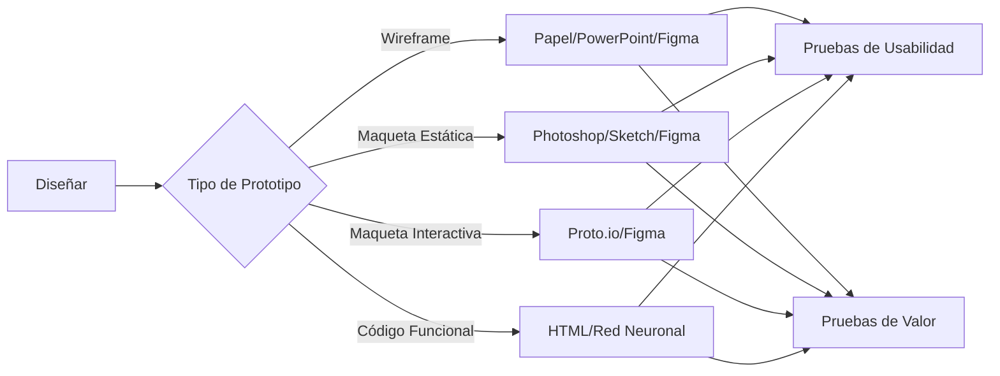

import { Callout, Steps, Step } from "nextra-theme-docs";

# 🛠 Crear Prototipo

Un prototipo es la representación de la experiencia de usuario propuesta y constituye el siguiente paso en el flujo de trabajo de Experimento. Los prototipos te permiten probar la usabilidad y el valor del diseño antes de que sea completamente desarrollado y lanzado. **En todos los casos, los prototipos deben ser desechables.**

Dependiendo del experimento, debes determinar el tipo de prototipo y las herramientas necesarias para construirlo:

- **Wireframe o boceto:** Suelen ser creados por el diseñador de producto usando herramientas tan simples como papel o PowerPoint, o tan sofisticadas como Figma.

- **Maqueta estática:** Suelen ser creadas por el diseñador de producto. Las herramientas estándar incluyen Photoshop, Sketch o Figma.

- **Maqueta interactiva:** Pueden incluir un alto nivel de detalle. Por lo general, son creadas por el diseñador de producto o el investigador de UX. Las herramientas estándar incluyen Proto.io y Figma.

- **Prototipo de código funcional:** Generalmente desarrollado por ingenieros de software, puede ser tan simple como HTML básico y tan complejo como una red neuronal profunda. Recuerda: ¡debe ser desechable!

<Callout>
Puedes aprender más sobre [prototipos y cómo seleccionar el adecuado aquí](https://uxdesign.cc/prototyping-and-how-to-choose-the-right-prototyping-tool-4e55b9fdbe54) y [aquí](https://www.uxmatters.com/mt/archives/2019/10/prototyping-when-what-how-and-why-to-use-prototypes-part-1.php).
</Callout>

<Steps>
### Paso 1

El diseñador de producto o investigador de UX selecciona el tipo de prototipo adecuado según el experimento.

### Paso 2 

Se crea el prototipo utilizando las herramientas apropiadas, asegurándose de que sea desechable.

### Paso 3

El prototipo se prepara para las [pruebas de usabilidad](/flujo-de-trabajo/probar-usabilidad) y [pruebas de valor](/flujo-de-trabajo/probar-valor) posteriores.
</Steps>

Ejemplo de un prototipo:

*Prototipo de AdsBunny. Sus pruebas de valor fallaron y, por lo tanto, nunca llegó a ver la luz del día.*

La fidelidad ($F$) de un prototipo se puede expresar como una función del nivel de detalle ($D$) y la interactividad ($I$):

$F = f(D, I)$

Donde $F$, $D$, $I$ $\in [0,1]$. Cuanto mayor sea $D$ e $I$, mayor será $F$. El prototipo ideal tendrá la fidelidad justa necesaria para validar las hipótesis del experimento de manera efectiva.