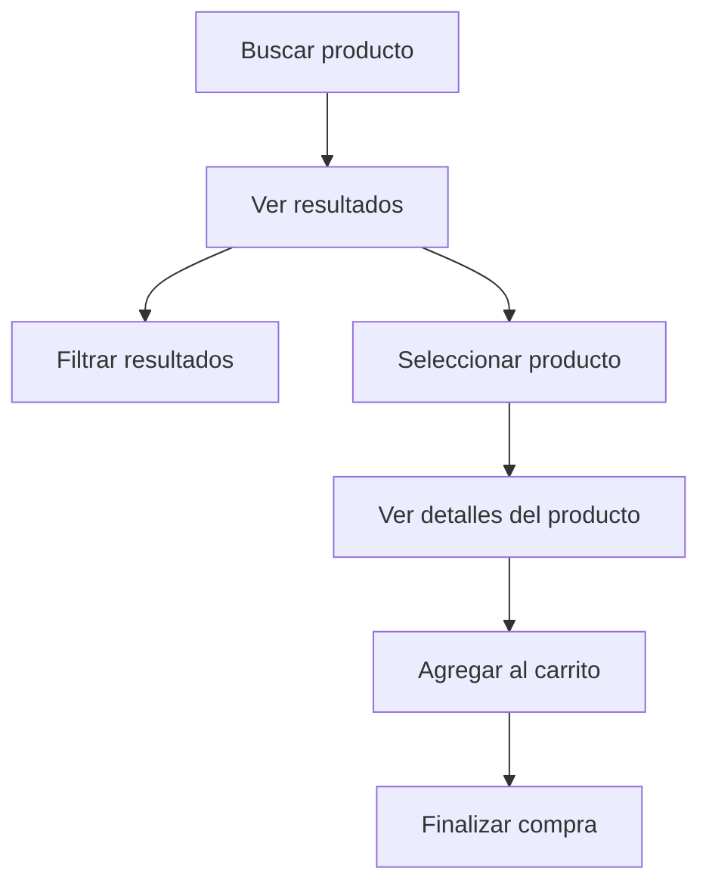

import { Callout, Steps, Step } from "nextra-theme-docs";

# 📝 Especificar

El prototipo ofrece una buena base para las especificaciones que se entregarán al equipo de ingeniería. Sin embargo, para productos complejos o maduros, eso puede no ser suficiente. Además del prototipo, algunos proyectos pueden beneficiarse de documentar casos de uso, mapas de historias de usuario y/o listas de interacciones de la interfaz de usuario. Estos ayudan a los ingenieros a comprender adecuadamente el alcance de su trabajo y reducir la ansiedad.

Más importante aún, las especificaciones detalladas permiten a los equipos tener un alto factor de autobús, lo que, a su vez, permite mejoras adicionales del producto a largo plazo. Las especificaciones permiten compartir el conocimiento del proyecto con futuros miembros de sus equipos técnicos (aprenda por qué esto es tan importante). El nivel de detalle debe inclinarse hacia la claridad en lugar de explicar lo obvio.

<Callout>
Los diseñadores de productos suelen ser los responsables de escribir y actualizar las especificaciones.
</Callout>

## Pasos para crear especificaciones efectivas

<Steps>

### Paso 1: Revisar el prototipo

Comience revisando el prototipo creado en el [paso de prototipado](/flujo-de-trabajo/crear-prototipo). Asegúrese de que el prototipo cubra todos los casos de uso y flujos clave.

### Paso 2: Documentar casos de uso adicionales

Identifique y documente cualquier caso de uso o flujo que pueda no estar cubierto adecuadamente en el prototipo. Estos podrían incluir:
- Casos extremos
- Manejo de errores 
- Estados vacíos
- Interacciones complejas

### Paso 3: Crear mapas de historias de usuario

Para funcionalidades más complejas, considere crear mapas de historias de usuario. Estos ayudan a visualizar la jornada del usuario y aseguran que todas las necesidades del usuario sean abordadas.

### Paso 4: Detallar interacciones de la interfaz de usuario

Documente las interacciones específicas de la interfaz de usuario que no pueden ser fácilmente discernidas del prototipo. Esto podría incluir:
- Validaciones de formularios
- Mensajes de error
- Animaciones o transiciones
- Comportamientos dependientes del estado

### Paso 5: Revisar y refinar

Revise las especificaciones con el equipo de ingeniería y recopile sus comentarios. Refine las especificaciones según sea necesario para asegurar claridad y exhaustividad.

</Steps>

Al seguir estos pasos, puede crear especificaciones completas que permitan a su equipo de ingeniería implementar la funcionalidad de manera eficiente y efectiva, al mismo tiempo que asegura una experiencia de usuario de alta calidad.