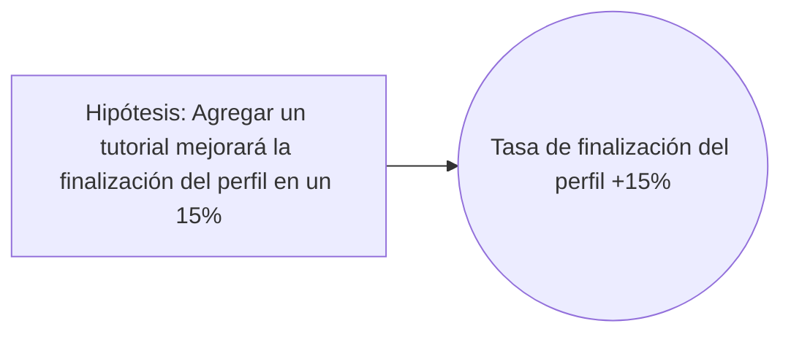

import { Callout, Steps, Step } from "nextra-theme-docs";

# 🤔 Generar Hipótesis

En este paso, se crea una lista de hipótesis junto con el nivel en el que ciertos indicadores de rendimiento deberían verse afectados para validar cada hipótesis. Por supuesto, un experimento puede tener cualquier número de hipótesis. Este paso es importante por dos razones:

1. Te permite mantenerte enfocado.
2. Permite a todos los miembros de tu equipo comprender rápidamente los objetivos detrás del experimento.

Por ejemplo:

* Hipótesis: Dado la oportunidad, los clientes descargarán muestras.
* Indicadores de rendimiento afectados:
  A. La tasa de conversión de búsqueda a reserva debería aumentar en un 10%.
  B. Nuevo indicador de rendimiento: Las muestras descargadas por sesión de búsqueda deberían aumentar en un 10%.

<Callout>
Al final de este paso, considera actualizar el nombre del experimento para reflejar mejor las hipótesis.
</Callout>

El paso de Generar Hipótesis podría ser realizado por el product manager o el product designer.

<Steps>

### Escribe hipótesis claras
Asegúrate de que tus hipótesis sean específicas, medibles y estén directamente relacionadas con los objetivos de tu experimento.

### Identifica los indicadores clave de rendimiento (KPIs)
Determina qué KPIs deberían verse afectados si tu hipótesis es correcta y en qué medida deberían cambiar.

### Actualiza el nombre del experimento
Considera modificar el nombre de tu experimento para que refleje mejor tus hipótesis y ayude a alinear al equipo.

</Steps>

Un ejemplo completo de una hipótesis bien escrita sería:

Recuerda, una hipótesis sólida toma la forma de:

$\text{Creemos que} [\text{variable independiente}] \text{ resultará en } [\text{variable dependiente}] \text{ por } [\text{lógica}]$

¿Listo para poner a prueba tus hipótesis? ¡Sigamos al siguiente paso, [Analizar Alternativas](/flujo-de-trabajo/analizar-alternativas)!