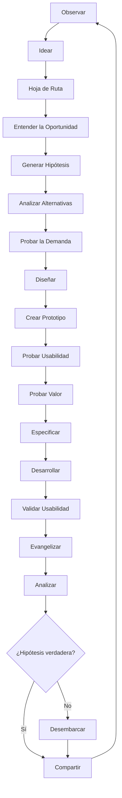

import { Callout, Steps, Step } from "nextra-theme-docs";

# Introducción

¡Bienvenido a Experimento! Un marco práctico de gestión de productos basado en experimentos. Experimento ha sido desarrollado y validado durante años por equipos en varias compañías, incluyendo Voice123, Bunny Studio, Torre y Tribe.

En Experimento, los experimentos pasan por los siguientes pasos:

<Steps>

### 👁 Observar
Observar cuidadosamente el entorno para generar ideas.

### 💡 Idear
Gestionar y priorizar ideas en un backlog.

### 🗺 Hoja de Ruta
Priorizar experimentos en una hoja de ruta detallada.

### 🔎 Entender la Oportunidad
Validar la deseabilidad preliminar de una idea.

### 🤔 Generar Hipótesis
Crear hipótesis e indicadores de rendimiento para validarlas.

### 🔬 Analizar Alternativas
Investigar cómo otros permiten experiencias y resultados similares.

### ✋ Probar la Demanda
Recopilar evidencia sobre la demanda de una nueva capacidad.

### 📐 Diseñar
Crear la experiencia de usuario de la funcionalidad.

### 🛠 Crear Prototipo
Construir una representación de la experiencia de usuario propuesta.

### 👩‍💻 Probar Usabilidad
Verificar que los usuarios puedan entender y usar el producto.

### ❤️ Probar Valor  
Determinar cuánto valoran los usuarios la solución propuesta.

### 📝 Especificar
Documentar los detalles para comunicar el alcance al equipo de ingeniería.

### ⌨️ Desarrollar
Implementar y lanzar la funcionalidad basada en el diseño y las especificaciones.

### 👨‍💻 Validar Usabilidad
Realizar pruebas de usabilidad con el producto real.

### 📣 Evangelizar
Demostrar la nueva funcionalidad y anunciarla a los usuarios.

### 📈 Analizar
Analizar los datos para validar o invalidar las hipótesis.  

### ↩️ Desembarcar
Considerar eliminar la funcionalidad si las hipótesis son incorrectas.

### 💬 Compartir 
Compartir el análisis con el equipo para aprender y mejorar.

### 🔄 Repetir
Comenzar el ciclo de nuevo con nuevas ideas generadas.

</Steps>

Dependiendo del experimento, algunos pasos pueden omitirse. Aquí hay un diagrama de flujo visual del proceso:

Experimento se basa en [Principios](/principios) clave que guían todo el proceso. Cada experimento es gestionado por un [equipo de producto](/principios/interesados) que sigue estas [Directrices](/principios/directrices).

<Callout>
Experimento combina lo mejor de los movimientos y marcos como Agile, Design Thinking, Lean Startup y otros, en un flujo de trabajo completo y práctico.
</Callout>

¿Listo para comenzar? ¡Sigue leyendo para aprender más sobre los detalles de cada paso del [Flujo de Trabajo del Experimento](/flujo-de-trabajo)!