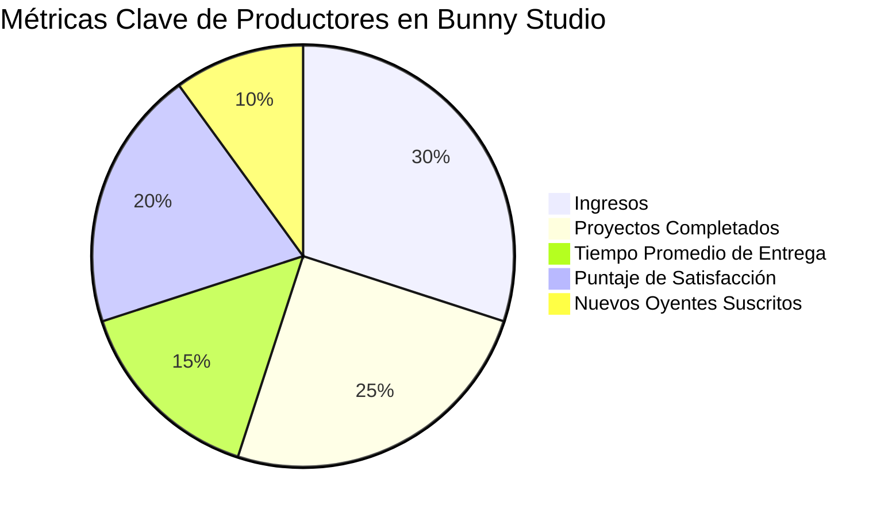

import { Callout, Steps, Step } from "nextra-theme-docs";

# Indicadores de Rendimiento (PIs)

Aunque los [KPIs](/introduccion) son cruciales, las redes de dos lados requieren que muchas cosas ocurran con éxito para que las interacciones principales crezcan. Las redes de dos lados son como un avión; requieren el monitoreo constante de múltiples factores para asegurar que el avión no se estrelle.

<Callout>
Las redes de dos lados son complejas y requieren un seguimiento meticuloso de muchas métricas para garantizar su éxito. Los CEOs y gerentes de producto deben revisar estos Indicadores de Rendimiento (PIs) regularmente, idealmente semanalmente, y buscar formas de mejorarlos.
</Callout>

Las redes de dos lados suelen tener dos tipos de usuarios: productores y consumidores. Debes tener PIs para cada tipo de usuario en cada etapa de su ciclo de vida.

<Steps>

### Paso 1: Identifica las etapas del ciclo de vida

Primero, identifica las etapas clave del ciclo de vida del cliente para tu red:

- **Conocimiento**: ¿Cómo se enteran los usuarios de tu red?
- **Adquisición**: ¿Cómo se registran los usuarios?
- **Activación**: ¿Cómo comienzan los usuarios a interactuar en tu red?
- **Ingresos**: ¿Cómo generas ingresos de los usuarios?
- **Retención**: ¿Cómo mantienes a los usuarios comprometidos y activos?
- **Referencia**: ¿Cómo los usuarios existentes atraen a nuevos usuarios?

### Paso 2: Establece PIs para cada etapa

Luego, establece PIs para medir el rendimiento en cada etapa, para productores y consumidores.

Por ejemplo, para la etapa de Activación de los consumidores, puedes medir:

- Costo de adquisición y activación de consumidores
- Número promedio de interacciones principales para nuevos consumidores
- Tiempo hasta la interacción principal para nuevos consumidores
- Tasa de éxito del primer intento de interacción principal

</Steps>

Debes adaptar estos PIs a tu red específica. Consulta las secciones [Métricas de Consumidores](/indicadores-rendimiento/metricas-consumidores) y [Métricas de Productores](/indicadores-rendimiento/metricas-productores) para obtener más detalles.

<Callout>
Recuerda que estas son solo sugerencias generales. Debes personalizar estas métricas para que se ajusten a los objetivos y necesidades únicos de tu red de dos lados.
</Callout>

Por ejemplo, en la red de crowdsourcing de grabaciones de voz Bunny Studio, algunos PIs clave para los productores (actores de voz) podrían ser:

Como puedes ver, estos PIs abarcan varias etapas del ciclo de vida, desde Ingresos hasta Retención y Referencia. Al monitorear estos indicadores, el equipo de Bunny Studio puede obtener una imagen completa del rendimiento de los productores clave.

En resumen, al establecer PIs sólidos para cada tipo de usuario en cada etapa, puedes monitorear de cerca el desempeño general de tu red de dos lados y tomar medidas para mejorar las áreas problemáticas. El seguimiento constante de estas métricas es esencial para el crecimiento y el éxito a largo plazo.