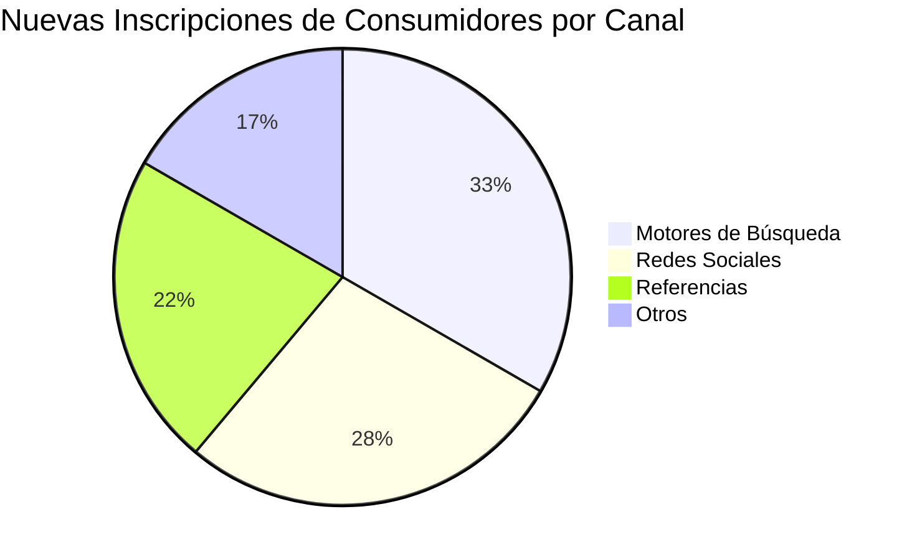
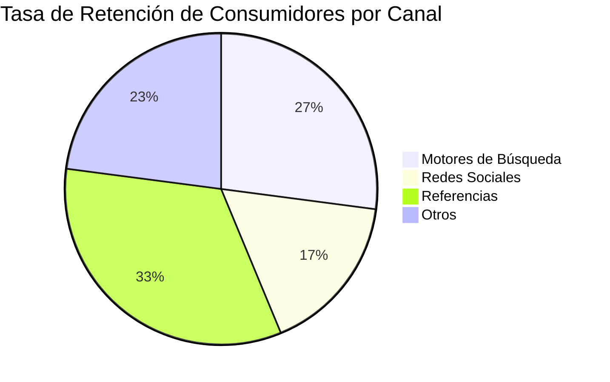

import { Callout, Steps, Step } from "nextra-theme-docs";

# Etapa de Adquisición

En la etapa de adquisición, nos enfocamos en atraer y registrar nuevos consumidores en la plataforma. Las métricas clave en esta etapa son:

- **Nuevas inscripciones de consumidores por canal**: Rastrea el número de nuevos consumidores que se inscriben en la plataforma, desglosado por los diferentes canales de adquisición (por ejemplo, motores de búsqueda, redes sociales, referencias, etc.). Esto nos ayuda a identificar los canales más efectivos para invertir nuestros esfuerzos de marketing.

- **Consumidores recién retenidos por canal**: Mide la tasa de retención de los nuevos consumidores adquiridos a través de cada canal. Esto es crucial, ya que nos interesa no solo adquirir consumidores, sino retenerlos en la plataforma.

<Callout>
💡 Un alto número de nuevas inscripciones no es útil si la mayoría de esos consumidores abandonan la plataforma rápidamente. Debemos enfocarnos en los canales que proporcionan consumidores comprometidos y de alta calidad.
</Callout>

Aquí hay un ejemplo de cómo podrías monitorear estas métricas:

En el ejemplo anterior, podemos ver que las referencias tienen la tasa de retención más alta, lo que sugiere que deberíamos enfocar nuestros esfuerzos en atraer más referencias de consumidores existentes.

<Steps>

### Paso 1
Monitorea las métricas de adquisición de consumidores de forma regular (semanal o mensual).

### Paso 2
Identifica los canales de mayor rendimiento en términos de nuevas inscripciones y retención.

### Paso 3 
Optimiza tus esfuerzos de marketing y asignación de recursos para enfocarte en los canales de mayor rendimiento.

### Paso 4
Prueba constantemente nuevas estrategias y campañas de adquisición para descubrir nuevas fuentes de consumidores de alta calidad.

</Steps>

Recuerda que la adquisición de consumidores es solo el primer paso. Una vez que los hayas atraído a la plataforma, necesitarás enfocar tus esfuerzos en [activarlos e incentivarlos](/indicadores-rendimiento/metricas-consumidores/metricas-consumidores-activacion) para que realicen interacciones principales.