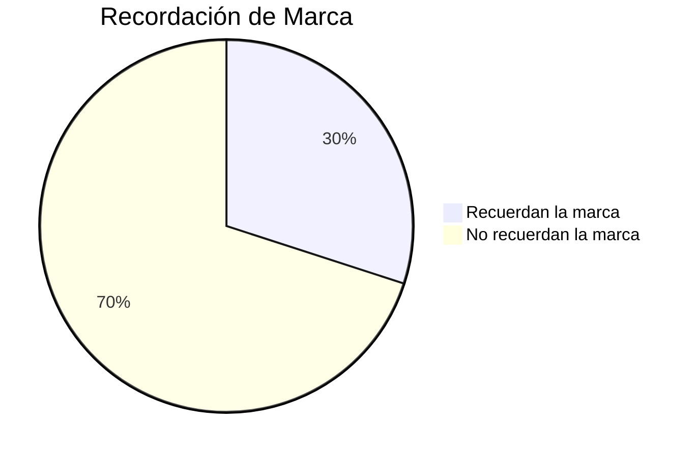

import { Callout, Steps, Step } from "nextra-theme-docs";

# Etapa de Conocimiento

La etapa de conocimiento es crucial para construir una red de dos lados exitosa. Si los usuarios potenciales no conocen tu plataforma, difícilmente podrán convertirse en consumidores o productores.

La métrica clave en esta etapa es el **porcentaje de recordación de marca**. Esto mide cuántas personas en tu mercado objetivo reconocen o recuerdan tu marca cuando se les pregunta.

Un alto porcentaje de recordación de marca indica que tus esfuerzos de marketing están dando frutos y que tu marca se está volviendo reconocible. Esto es importante porque los usuarios deben conocer tu plataforma antes de considerar usarla.

<Callout>
💡 Incluso las grandes marcas como Google, Amazon y Facebook realizan encuestas regulares para medir su recordación de marca. Es una métrica clave para rastrear el éxito del marketing y la creación de marca.
</Callout>

Puedes aumentar la recordación de marca a través de:

- Marketing de contenidos y SEO para crear conciencia
- Publicidad en línea y fuera de línea
- Relaciones públicas y marketing de influencers
- Eventos y activaciones

<Steps>

### Paso 1: Establece una línea base

Realiza una encuesta inicial a tu mercado objetivo para medir la recordación de marca actual. Esto te dará un punto de referencia.

### Paso 2: Implementa estrategias de marketing

Comienza tus campañas de marketing de marca, publicidad, relaciones públicas, etc. para aumentar la conciencia.

### Paso 3: Mide periódicamente

Repite la encuesta de recordación de marca cada cierto tiempo (mensual, trimestral) para ver cómo está cambiando. Ajusta tus estrategias según sea necesario.

</Steps>

No olvides hacer un seguimiento de la recordación de marca por segmento (edad, ubicación, etc.) ya que es posible que tu marca sea más conocida en ciertos grupos.

Una vez que logres altos niveles de recordación de marca, significa que tu mercado objetivo está listo para convertirse potencialmente en [consumidores o productores](/indicadores-rendimiento/metricas-consumidores/metricas-consumidores-adquisicion). ¡Pero primero debes construir ese conocimiento de marca!