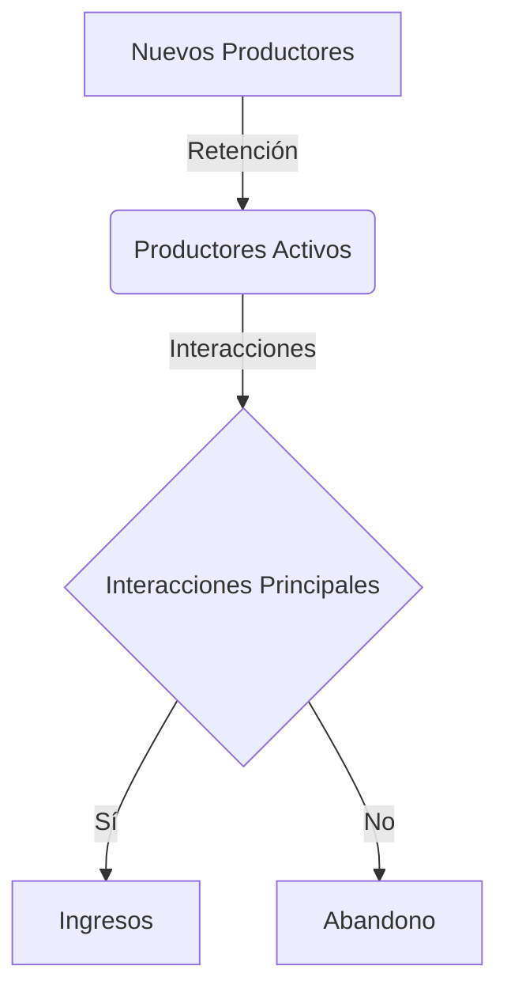

import { Callout, Steps, Step } from "nextra-theme-docs";

# Métricas de Productores

Las métricas de productores son cruciales para monitorear y mejorar la experiencia del lado de la oferta en una red de dos lados. Al igual que con los consumidores, es importante rastrear a los productores a través de las diferentes etapas del ciclo de vida del cliente.

<Callout>
Recuerda que en algunas redes de dos lados, los roles de productor y consumidor pueden intercambiarse. En ese caso, estas métricas se pueden adaptar según corresponda.
</Callout>

A continuación, se presentan las métricas clave para los productores, agrupadas por etapa del ciclo de vida:

### General

- [Análisis de embudo por cohorte](/indicadores-rendimiento/metricas-productores/metricas-productores-general)

### Etapa de Conocimiento

- [Porcentaje de recordación de marca](/indicadores-rendimiento/metricas-productores/metricas-productores-conocimiento)

### Etapa de Adquisición

- [Nuevas inscripciones de productores por canal](/indicadores-rendimiento/metricas-productores/metricas-productores-adquisicion)
- [Productores recién retenidos por canal](/indicadores-rendimiento/metricas-productores/metricas-productores-adquisicion)

### Etapa de Activación

- [Costo de adquisición y activación de productores](/indicadores-rendimiento/metricas-productores/metricas-productores-activacion)
- [Número promedio de interacciones principales para nuevos productores](/indicadores-rendimiento/metricas-productores/metricas-productores-activacion)
- [Tiempo hasta la interacción principal para nuevos productores](/indicadores-rendimiento/metricas-productores/metricas-productores-activacion)
- [% de nuevos listados que conducen a interacciones principales dentro de un período dado](/indicadores-rendimiento/metricas-productores/metricas-productores-activacion)

<Steps>

### Paso 1

Monitorea de cerca las métricas de activación de productores. Si los productores no se activan e interactúan con la red, no habrá suficiente oferta para satisfacer la demanda de los consumidores.

### Paso 2

Busca oportunidades para optimizar el proceso de activación, como mejorar la experiencia de onboarding, proporcionar más educación o recursos, o simplificar los flujos de trabajo.

</Steps>

### Etapa de Ingresos

- [Ingresos](/indicadores-rendimiento/metricas-productores/metricas-productores-ingresos)
- [Valor de vida útil (LTV)](/indicadores-rendimiento/metricas-productores/metricas-productores-ingresos)

### Etapa de Retención

- [Listados (o equivalente) creados](/indicadores-rendimiento/metricas-productores/metricas-productores-retencion)
- [Interacciones principales promedio por cohorte](/indicadores-rendimiento/metricas-productores/metricas-productores-retencion)
- [% de listados existentes que conducen a interacciones principales](/indicadores-rendimiento/metricas-productores/metricas-productores-retencion)
- [Productores únicos que tienen interacciones principales](/indicadores-rendimiento/metricas-productores/metricas-productores-retencion)
- [Compromiso por visita](/indicadores-rendimiento/metricas-productores/metricas-productores-retencion)
- [Porcentaje de productores activos](/indicadores-rendimiento/metricas-productores/metricas-productores-retencion)  
- [Abandono por cohorte](/indicadores-rendimiento/metricas-productores/metricas-productores-retencion)

La retención de productores es fundamental. Cuantos más productores activos haya en la red, más oferta habrá disponible para satisfacer la demanda de los consumidores.

### Etapa de Referencia

- [Factor K para atraer a otros productores](/indicadores-rendimiento/metricas-productores/metricas-productores-referencia)
- [Factor K para atraer a consumidores](/indicadores-rendimiento/metricas-productores/metricas-productores-referencia)  
- [Puntuación del Promotor Neto (NPS)](/indicadores-rendimiento/metricas-productores/metricas-productores-referencia)

<Callout>
Al igual que con los consumidores, el boca a boca y las referencias son clave para el crecimiento de la red de productores. Un NPS alto y un fuerte factor K para atraer a otros productores pueden impulsar un círculo virtuoso de crecimiento.
</Callout>

Estas son las métricas principales que debes monitorear para el lado de los productores. A medida que tu red crezca, es posible que necesites agregar métricas adicionales o modificar estas según tus necesidades específicas.