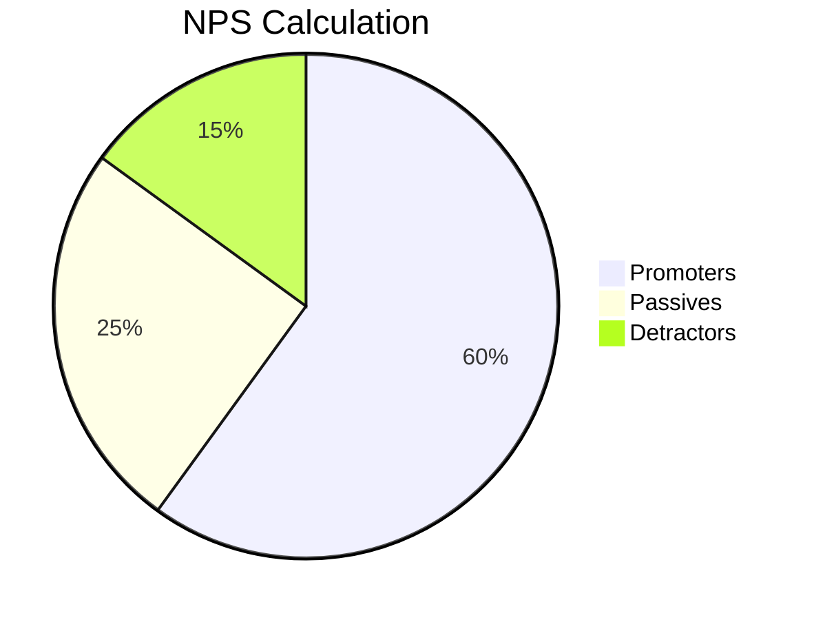

import { Callout, Steps, Step } from "nextra-theme-docs";

# Etapa de Referencia

Esta etapa se enfoca en las métricas relacionadas con la capacidad de los productores para atraer a otros usuarios, tanto productores como consumidores, a la plataforma. Estas métricas son cruciales para medir los efectos de red y el crecimiento orgánico de la plataforma.

## Factor K para Atraer a Otros Productores

El factor K es una métrica que mide la capacidad de un usuario para atraer a nuevos usuarios a la plataforma. En el caso de los productores, esta métrica se enfoca en cuántos nuevos productores son atraídos por cada productor existente en un período determinado.

<Callout>
El factor K para atraer a otros productores es un indicador clave del efecto de red entre los productores. Un factor K alto sugiere un fuerte efecto de red, lo que puede impulsar un crecimiento exponencial de la oferta en la plataforma.
</Callout>

Para calcular este factor, puedes seguir estos pasos:

<Steps>

### Paso 1

Determina un período de tiempo relevante (por ejemplo, un mes).

### Paso 2

Calcula el número de nuevos productores que se registraron durante ese período.

### Paso 3

Calcula el número total de productores existentes al inicio del período.

### Paso 4

Divide el número de nuevos productores por el número de productores existentes.

$$
\text{Factor K} = \frac{\text{Nuevos Productores}}{\text{Productores Existentes}}
$$

</Steps>

Por ejemplo, si en un mes se registraron 100 nuevos productores y había 1,000 productores existentes al inicio del mes, el factor K sería 0.1 (100 / 1,000).

## Factor K para Atraer a Consumidores

De manera similar, el factor K para atraer a consumidores mide la capacidad de los productores para atraer a nuevos consumidores a la plataforma. Esta métrica es especialmente importante para las redes de dos lados, ya que refleja la fortaleza del efecto de red entre los dos lados.

<Callout>
Un factor K alto para atraer a consumidores sugiere que los productores están creando un valor significativo para los consumidores, lo que a su vez impulsa el crecimiento del lado de la demanda en la plataforma.
</Callout>

El cálculo es similar al factor K para atraer a otros productores, pero en este caso, se divide el número de nuevos consumidores por el número de productores existentes.

## Puntuación del Promotor Neto (NPS)

La puntuación del Promotor Neto (NPS) es una métrica ampliamente utilizada para medir la lealtad y la satisfacción de los clientes. En el contexto de las redes de dos lados, el NPS se puede aplicar tanto a los productores como a los consumidores.

<Callout>
Un NPS alto sugiere que los usuarios (productores o consumidores) están satisfechos con la plataforma y es probable que la recomienden a otros, lo que puede impulsar un crecimiento orgánico y un aumento en los efectos de red.
</Callout>

Para calcular el NPS, se le pide a los usuarios que califiquen su probabilidad de recomendar la plataforma en una escala del 0 al 10. Luego, se dividen en tres grupos:

- **Promotores** (puntuación de 9 o 10): usuarios leales y entusiastas
- **Pasivos** (puntuación de 7 u 8): usuarios satisfechos pero desapegados
- **Detractores** (puntuación de 0 a 6): usuarios insatisfechos y propensos a dañar la reputación de la marca

El NPS se calcula restando el porcentaje de detractores del porcentaje de promotores.

En el ejemplo anterior, si el 60% de los usuarios son promotores y el 15% son detractores, el NPS sería 45 (60 - 15).

Es recomendable realizar encuestas de NPS regularmente y analizar los resultados por segmento (por ejemplo, productores vs. consumidores, tipos de usuarios, ubicaciones geográficas, etc.). Esto puede proporcionar información valiosa sobre las áreas que necesitan mejoras y los segmentos de usuarios más satisfechos o insatisfechos.

Al monitorear estas métricas de referencia, puedes obtener una mejor comprensión de la fortaleza de tus efectos de red y el crecimiento orgánico de tu plataforma. Recuerda que un enfoque equilibrado en ambos lados de la red es crucial para el éxito a largo plazo de una red de dos lados.