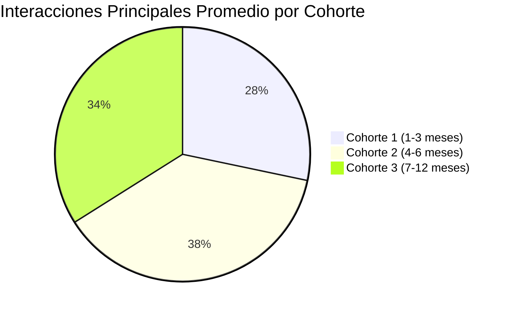

import { Callout, Steps, Step } from "nextra-theme-docs";

# Etapa de Retención

La etapa de retención es crucial para el éxito a largo plazo de una red de dos lados. Después de adquirir y activar a los productores, es necesario mantenerlos comprometidos y activos en la plataforma. Un productor inactivo no solo representa una pérdida de ingresos potenciales, sino que también puede afectar la experiencia de los consumidores y dañar la reputación de la red.

Algunas métricas importantes para monitorear la retención de los productores son:

- **Listados (o equivalente) creados**: Número de nuevos listados, anuncios, servicios u ofertas publicadas por los productores. Un número creciente indica que los productores siguen activos y comprometidos con la plataforma.

<Callout>
Para Voice123, una plataforma que conecta clientes con actores de voz, esta métrica sería el número de nuevos perfiles de actores de voz creados o actualizados.
</Callout>

- **Interacciones principales promedio por cohorte**: Número promedio de interacciones principales (como proyectos completados o ventas realizadas) por cohorte de productores. Esto muestra cómo evolucionan los niveles de actividad a lo largo del tiempo.

- **Porcentaje de listados existentes que conducen a interacciones principales**: Proporción de listados, anuncios o servicios existentes que generan interacciones principales en un período determinado. Esto indica qué tan atractivas son las ofertas de los productores para los consumidores.

- **Productores únicos que tienen interacciones principales**: Número de productores individuales que han tenido al menos una interacción principal en un período determinado. Esto muestra el alcance de la actividad de los productores.

- **Compromiso por visita**: Medido en interacciones principales o tiempo gastado en la plataforma por visita. Un compromiso alto indica que los productores encuentran valor en la plataforma.

- **Porcentaje de productores activos**: Proporción de productores que han tenido al menos una interacción principal en un período determinado (por ejemplo, los últimos 30 días). Esto ayuda a diferenciar entre productores activos e inactivos.

- **Abandono por cohorte**: Tasa a la cual los productores dejan de usar la plataforma, por cohorte. Comprender las razones del abandono puede ayudar a abordar los problemas de retención.

<Steps>

### Paso 1: Medir las métricas de retención de productores

Comienza midiendo las métricas mencionadas anteriormente utilizando las herramientas de análisis de datos disponibles. Asegúrate de segmentar los datos por cohortes y otros atributos relevantes.

### Paso 2: Identificar tendencias y problemas

Analiza las métricas para identificar tendencias, puntos problemáticos y áreas de mejora. Por ejemplo, un alto abandono en una cohorte específica podría indicar problemas con la experiencia del usuario o falta de valor percibido.

### Paso 3: Desarrollar estrategias de retención

Basado en tus hallazgos, desarrolla estrategias para mejorar la retención de los productores. Esto puede incluir optimizar la experiencia del usuario, ofrecer más incentivos, mejorar la comunicación y el soporte, o agregar nuevas características.

### Paso 4: Implementar y monitorear

Implementa tus estrategias de retención y monitorea de cerca las métricas para evaluar su efectividad. Ajusta tus esfuerzos según sea necesario.

### Paso 5: Iterar y mejorar

La retención es un proceso continuo. Continúa monitoreando, experimentando e iterando para mantener a los productores comprometidos y activos en la plataforma.

</Steps>

Al mantener un enfoque en las métricas de retención de productores, puedes tomar medidas proactivas para abordar los problemas y mantener un lado fuerte y activo de la red, lo que a su vez mejorará la experiencia de los consumidores y el éxito general de la plataforma.

**Recursos relacionados:**

- [Etapa de Retención de Consumidores](/indicadores-rendimiento/metricas-consumidores/metricas-consumidores-retencion)
- [Puntuación del Promotor Neto (NPS)](/indicadores-rendimiento/metricas-productores/metricas-productores-referencia#puntuacion-del-promotor-neto-nps)