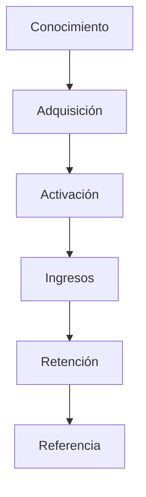

import { Callout, Steps, Step } from "nextra-theme-docs";

# Recursos Adicionales

Esta sección proporciona referencias adicionales y recursos para aprender más sobre las métricas y los modelos de negocio de las redes de dos lados. Consultarlos puede ayudarte a profundizar tu comprensión y aplicar mejor los conceptos cubiertos en este manual.

## Libros Recomendados

- **[Platform Revolution](https://a.co/d/1YdxSrU)** de Geoffrey G. Parker, Marshall W. Van Alstyne y Sangeet Paul Choudary. Este libro es considerado una biblia para entender las plataformas y redes de dos lados. Cubre varios conceptos clave, incluyendo la definición de "interacción principal" que se menciona en la [sección de introducción](/introduccion).

- **[Inspired](https://a.co/d/4yUZF95)** de Marty Cagan. Aunque no se centra específicamente en las redes de dos lados, este libro es una excelente guía para crear productos exitosos, lo cual es fundamental para cualquier plataforma.

<Callout>
**Nota:** Ambos libros se recomiendan en la fuente principal y contienen información valiosa que complementa este manual.
</Callout>

## Marco del Ciclo de Vida del Cliente

El famoso [marco del ciclo de vida del cliente](https://www.forentrepreneurs.com/inside-intercom-metrics/) de Dave McClure proporciona una estructura útil para pensar en las métricas de las redes de dos lados. Como se menciona en la [sección de Indicadores de Rendimiento](/indicadores-rendimiento), las métricas se organizan según las etapas del ciclo de vida del cliente:

## Modelos Adicionales

Además de las redes de empleo, existen otros tipos de redes de dos lados con desafíos y métricas únicos. Por ejemplo:

- Redes sociales (Facebook, Twitter)
- Marketplaces (Amazon, eBay)
- Sistemas de reservas (Airbnb, OpenTable)

Aunque este manual se centra en los principios fundamentales, puede ser útil estudiar los modelos específicos que son relevantes para tu negocio.

## Recursos En Línea

Hay una gran cantidad de artículos, blogs y foros en línea que discuten las métricas y los modelos de negocio de las redes de dos lados. Aquí hay algunos recursos excelentes para comenzar:

- [16 Métricas para Evaluar una Plataforma Digital de Dos Lados](https://www.apppicker.com/blog/16-platform-metrics)
- [Hoja de referencia de métricas de plataforma de NFX](https://www.nfx.com/post/network-effects-manual)
- [Foro de Plataformas en GrowthHackers](https://growthhackers.com/topics/platforms)

<Callout>
**Consejo Pro:** Suscríbete a boletines como [PlatformSignals](https://platformed.info/) para mantenerte actualizado sobre las últimas tendencias y mejores prácticas en el espacio de las plataformas.
</Callout>