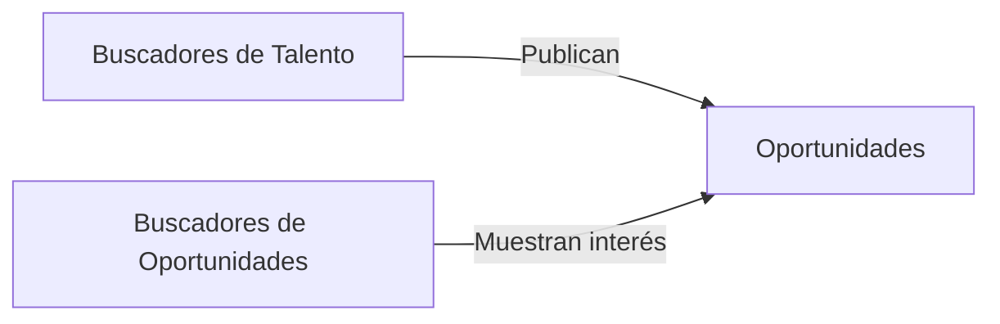

import { Callout, Steps, Step } from "nextra-theme-docs";

# Conectando la Oferta y la Demanda

Las redes relacionadas con el empleo tienen un conjunto de desafíos únicos. La distinción entre productor y consumidor, y entre oferta y demanda, no siempre es clara. ¿Es el consumidor la persona que busca candidatos (buscador de talento) o el candidato que busca oportunidades (buscador de oportunidades)? ¿El ítem consumido son los perfiles de los candidatos o las oportunidades laborales?

<Callout>
Si se sigue el flujo del dinero, se podría argumentar que la demanda consiste en buscadores de talento y la oferta consiste en buscadores de oportunidades. Sin embargo, los profesionales en alta demanda pueden esperar a que los buscadores de talento les envíen ofertas para considerar.
</Callout>

Este es el caso de muchos ingenieros de software en LinkedIn y actores de voz famosos en [Voice123](/redes-empleo/redes-empleo-vistas-perfil), una red que conecta a clientes con actores de voz. Debido a esto, en las redes relacionadas con el empleo, hay dos formas comunes de conectar los dos lados:

<Steps>

### Paso 1

Permitir a los buscadores de talento publicar oportunidades y dejar que los buscadores de oportunidades muestren su interés.

### Paso 2

Otorgar a los buscadores de talento acceso a una base de datos de talento y contactar a los buscadores de oportunidades individualmente.

</Steps>

Por ejemplo, en una red como LinkedIn, las empresas pueden publicar oportunidades laborales y los candidatos pueden aplicar ($\text{Paso 1}$). Alternativamente, los reclutadores pueden buscar en la base de datos de perfiles de LinkedIn y contactar directamente a los candidatos potenciales ($\text{Paso 2}$).

Las redes relacionadas con el empleo suelen combinar estos dos enfoques. Es importante tener métricas separadas para cada modelo, ya que implican diferentes flujos de trabajo e interacciones.