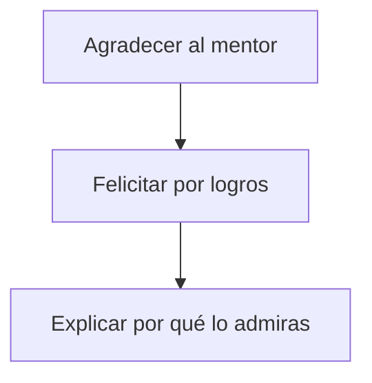

import { Callout, Steps, Step } from "nextra-theme-docs";

# Reunirse con el Mentor

La reunión con un mentor es una excelente oportunidad para aprender de su experiencia y obtener valiosos consejos. Es importante prepararse adecuadamente y conducirse de manera respetuosa para aprovechar al máximo esta oportunidad.

<Callout>
Recuerda, la puntualidad es fundamental cuando te reúnes con un mentor. Su tiempo es extremadamente valioso, así que asegúrate de llegar 15 minutos antes, incluso si es una videoconferencia. Llegar tarde dejará una mala impresión.
</Callout>

Durante la sesión de mentoría, sigue estos pasos:

<Steps>

### Paso 1
Apaga tu teléfono para evitar distracciones. La sesión debe ser un espacio centrado y de atención plena.

### Paso 2 
Rompe el hielo de manera casual si es posible. Puedes comentar sobre alguna actividad reciente del mentor que hayas visto en redes sociales.

### Paso 3
Agradece sinceramente al mentor por su tiempo y felicítalo por sus logros. Explica con pasión por qué lo admiras.

### Paso 4 
Pregunta al mentor cuál es su motivación para reunirse contigo. Esto te dará un vistazo a su perspectiva y te ayudará a enfocar la conversación.

### Paso 5
Presenta tu compañía y el proyecto en el que estás trabajando. Sé apasionado y sincero. Tu nivel de energía determinará el nivel de entusiasmo del mentor.

### Paso 6
Haz tus preguntas clave. Toma notas en un cuaderno (no uses dispositivos electrónicos). Gestiona el tiempo sabiamente para cubrir todas tus preguntas y dejar espacio para preguntas de seguimiento.

### Paso 7
Los mejores mentores te ayudarán a identificar posibles errores. No trates de justificarlos, sólo escucha y aprende. Como dijo Mario Andretti: "Si todo parece bajo control, simplemente no vas lo suficientemente rápido".

### Paso 8
Unos minutos antes de terminar, pregunta si hay alguna manera en que puedas ayudar al mentor. Esto demuestra tu disposición a colaborar.

### Paso 9
Pide recomendaciones de otros mentores potenciales, preguntando "¿A quién crees que podría hablar sobre esto?". Casi siempre obtendrás sugerencias valiosas.

### Paso 10
Consulta si el mentor desea recibir actualizaciones sobre tu progreso. Luego agradece una vez más por su tiempo y consejos.

</Steps>

Una sesión de mentoría bien conducida te dejará con nuevos conocimientos, perspectivas frescas y posiblemente nuevas conexiones con otros mentores recomendados. Recuerda hacer un [seguimiento](/seguimiento) adecuado después de la reunión.

Ahora que sabes cómo reunirte con un mentor, echa un vistazo a la sección sobre [identificar mentores potenciales](/identificar-mentores) y [comprometerse con ellos](/comprometerse-mentores) antes de programar tu próxima sesión.