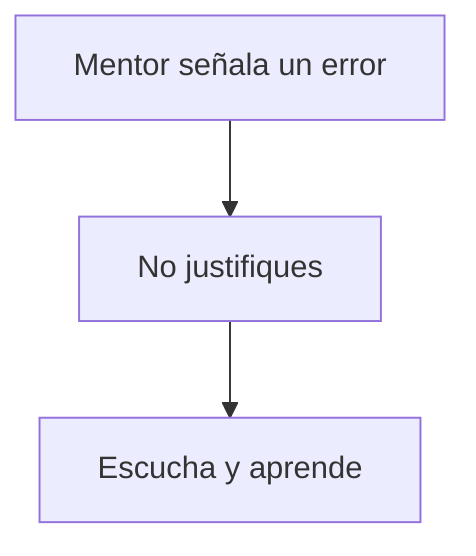

import { Callout, Steps, Step } from "nextra-theme-docs";

# Durante la Sesión de Mentoría

Sigue estos pasos durante la sesión de mentoría para aprovecharla al máximo:

<Steps>

### Paso 1

**Apaga tu teléfono** para evitar distracciones.

### Paso 2 

**Rompe el hielo** si es posible. Comentarios casuales sobre actividades o intereses recientes del mentor en redes sociales pueden ser un buen inicio de conversación.

### Paso 3

**Agradece al mentor** por su tiempo y felicítalo por sus logros. Explica sinceramente por qué lo admiras. Esto establece un tono positivo.

<Callout>
Un buen ejemplo: "Gracias por reunirse conmigo hoy, Alex. Admiro mucho su éxito en construir y escalar StartupX. ¡Realmente es una inspiración!"
</Callout>

### Paso 4

Menciona que tienes un número específico de preguntas preparadas y **esperas poder hacerlas todas** antes de que termine el tiempo asignado.

### Paso 5

**Pregunta al mentor su motivación** para reunirse contigo. Escuchar su perspectiva puede brindarte información valiosa para futuras interacciones.

### Paso 6 

**Presenta tu compañía y proyecto** al mentor, explicando el por qué y el cómo. Sé apasionado y sincero. Tu nivel de energía determinará el entusiasmo del mentor.

<Callout>
Por ejemplo: "Estamos construyendo AppX para resolver el problema Y que enfrenta el segmento Z. Nuestra visión es..."
</Callout>

### Paso 7

**Haz tus preguntas clave**. No hagas preguntas simples de sí/no que podrían responderse por correo. Ejemplos:

- "Tuviste éxito en X, algo similar a lo que intentamos. ¿Cuáles fueron las razones clave de tu éxito?"
- "¿Qué errores cometiste que deberíamos evitar?"  
- "Si en 6 meses nos enteramos que fracasamos en este frente, ¿cuáles podrían ser las razones?"

### Paso 8

**Toma notas** de algunas respuestas en un cuaderno físico, no con dispositivos electrónicos. Esto demuestra que lo tomas en serio.

### Paso 9

**No justifiques tus errores** si el mentor los señala. No debatas. Escucha y aprende.

### Paso 10 

Unos minutos antes de terminar, **pregunta al mentor cómo podrías ayudarlo** de alguna manera. Es una buena práctica profesional.

</Steps>

<Callout>
Además, pregunta al mentor si puede **sugerir otros mentores** con los que debas hablar: "¿A quién más crees que debería contactar sobre esto?"
</Callout>

<Callout>
Por último, pregunta al mentor si **le gustaría recibir actualizaciones** sobre tu progreso en el futuro.
</Callout>

Finalmente, **agradece nuevamente al mentor** por su tiempo y consejos invaluables.

El seguimiento es clave tras la sesión. Deberías enviar un correo de agradecimiento, [compartir aprendizajes con tu equipo](/seguimiento), y posiblemente programar otra reunión de seguimiento con el mentor.