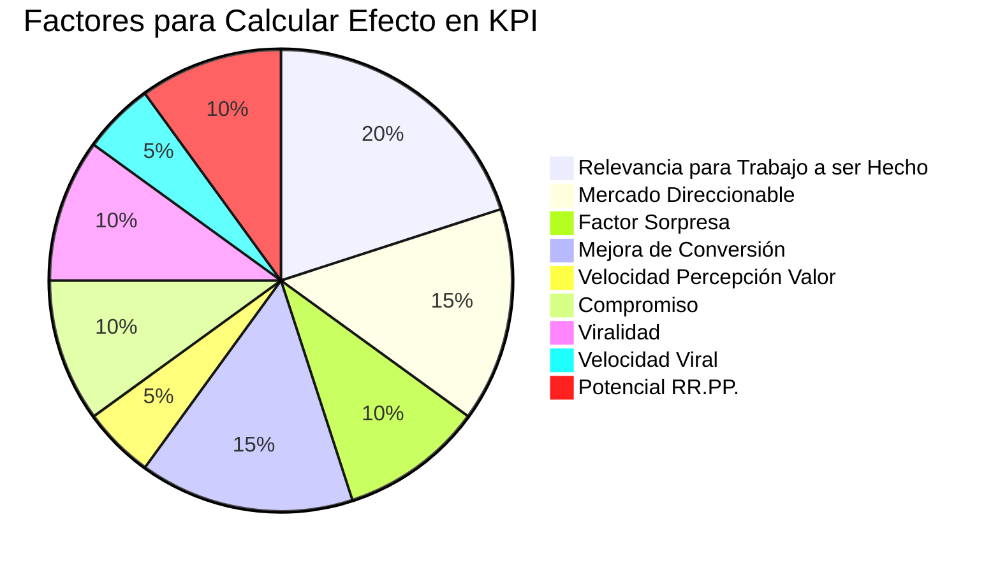

import { Callout, Steps, Step } from "nextra-theme-docs";

# KPI Principal

El KPI Principal (Key Performance Indicator o Indicador Clave de Rendimiento) refleja la interacción principal del producto. Es la métrica que mejor captura el éxito de tu producto. Por ejemplo:

- **Bunny Studio**: Número de proyectos completados
- **Voice123**: Proyectos enviados y mensajes enviados
- **Torre**: Número de tareas creadas y completadas

El Efecto-en-KPI-Principal es el delta (la diferencia entre el después y el antes) esperado en ese KPI una vez que la nueva funcionalidad o tarea esté implementada. 

<Callout>
El Efecto-en-KPI-Principal podría estimarse en términos del número absoluto de interacciones principales durante un período de tiempo, los ingresos asociados con ellos, o su respectivo porcentaje.
</Callout>

Algunas unidades comunes incluyen:

- 50.000 verificaciones/año
- $500k en proyectos/mes 
- 20% de verificaciones
- 20% de ingresos de proyectos

Alternativamente, el Efecto-en-KPI-Principal podría ser un índice calculado tomando en cuenta varios otros factores. Por ejemplo, en Torre, la mayoría de los equipos analizan estos factores compuestos para cada nueva funcionalidad:

- **Relevancia para el trabajo a ser hecho del usuario**: Medido en una escala de 0 a 10. 
  - 0 para "no resuelve el trabajo a ser hecho" 
  - 10 para "siempre lo resuelve"
- **Mercado total direccionable**: Número de personas que podrían usar la nueva funcionalidad
- **Factor sorpresa**: Medido de 1 a 10. 
  - 1 para "Meh"
  - 10 para "tan impresionante como la primera vez que vi el iPhone"
- **Mejora de la conversión**: Probabilidad aumentada de que los visitantes se conviertan en usuarios registrados (0 a 100%)
- **Velocidad de percepción de valor**: Medido en 1/d, donde d son los días que tomará a los nuevos usuarios percibir el valor después de registrarse
- **Compromiso**: Número de interacciones potenciales por semana
- **Viralidad**: Cuántos usuarios nuevos podemos esperar que un nuevo usuario promedio traiga durante sus primeros 30 días
- **Velocidad viral**: Medido en 1/d, donde d es el número de días que probablemente tomará a un nuevo usuario promedio enviar la primera invitación a otros
- **Potencial de RR.PP.**: Medido de 1 a 10 
  - 1 para "Meh"
  - 10 para "primer aterrizaje en la luna"

Mientras estos factores se aplican a la mayoría de los equipos en Torre, no se aplican a todos. Por ejemplo, el equipo de SEO usa otros factores como búsquedas mensuales, competitividad y contenido generado por el usuario.

<Steps>

### Paso 1
Define el KPI Principal que mejor refleja el objetivo principal de tu producto.

### Paso 2 
Estima el Efecto-en-KPI-Principal esperado de la nueva funcionalidad o tarea, ya sea en términos absolutos, porcentuales o usando un índice compuesto.

</Steps>

El KPI Principal y su Efecto esperado son las piezas fundamentales para [priorizar nuevas funcionalidades y tareas](/priorizando-nuevas-funcionalidades-tareas). Asegúrate de estimarlos cuidadosamente para una priorización precisa.