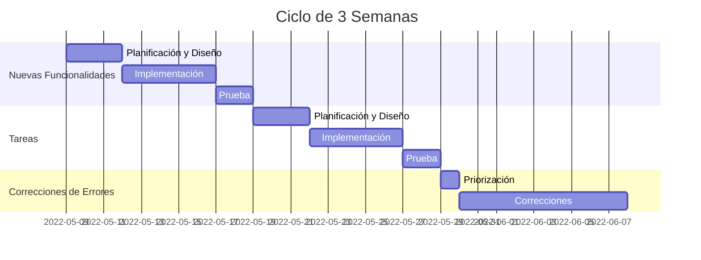

import { Callout, Steps, Step } from "nextra-theme-docs";

# Priorización Basada en la Asignación de Tiempo

Esta priorización se basa en la premisa de que tener nuevas funcionalidades de producto es esencial, incluso si el producto continúa teniendo algunas fallas. Esto se aplica a compañías donde el producto es un facilitador del negocio más que el negocio en sí. Por ejemplo, mercados en línea (donde los usuarios vienen por la red de compradores o vendedores en lugar de por el producto que potencia la red) y tiendas en línea (donde los usuarios vienen por los artículos que se venden, más que por la experiencia de compra).

Aquí, puedes intentar distribuir tus esfuerzos equitativamente entre los tres tipos de tareas. Para hacer eso, divide el tiempo disponible para los equipos de producto e ingeniería en ciclos de tres semanas:

<Steps>

### Semana 1
Trabajar en **nuevas funcionalidades**

### Semana 2 
Trabajar en **tareas** (defectos de diseño)

### Semana 3
Trabajar en **correcciones de errores**

</Steps>

<Callout>
Este ciclo de tres semanas se repite continuamente, asignando tiempo dedicado a cada tipo de tarea.
</Callout>

En algunos casos, sin embargo, este ciclo no será suficiente. Por ejemplo, cuando estás implementando una característica compleja o pagando una cantidad significativa de [deuda técnica](/priorizando-nuevas-funcionalidades-tareas/complejidad-implementacion). En esos casos, es valioso asignar tiempo específico para ello.

<Callout type="warning">
El equipo de ingeniería también puede pagar deuda técnica al implementar tareas y nuevas funcionalidades, pero a veces es valioso asignar tiempo específico para ello.
</Callout>

Por cierto, ambos ciclos funcionan bien con el marco [Experimento](/), Scrum y otras metodologías ágiles.

Aquí hay un ejemplo de cómo podría verse este ciclo de tres semanas en un tablero de Jira:

Este es solo un ejemplo, y los tiempos exactos dependerán de la complejidad de las tareas individuales y el tamaño de tu equipo. El punto principal es tener ciclos dedicados para cada tipo de tarea.