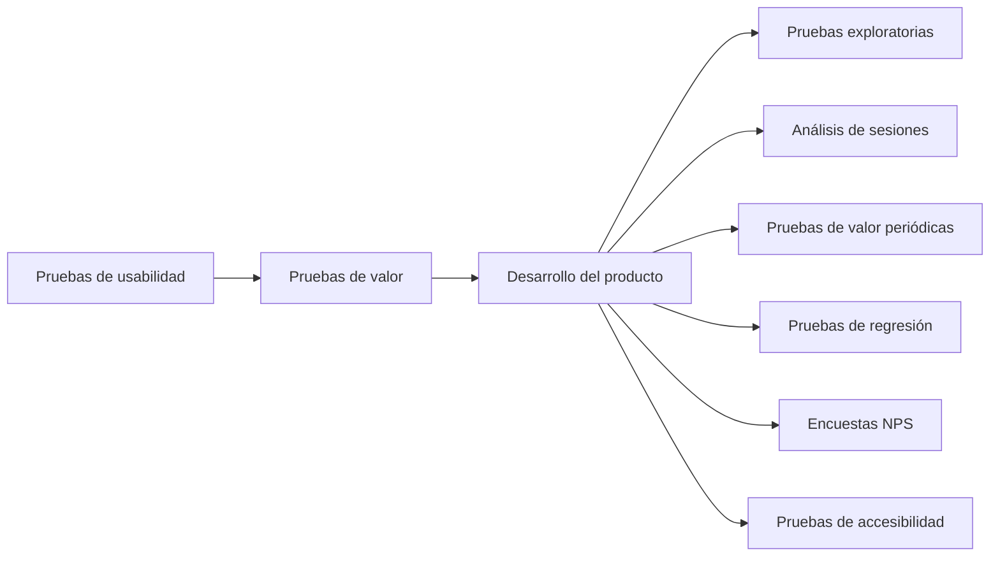

import { Callout, Steps, Step } from "nextra-theme-docs";

# Introducción

Bienvenidos a la **Metodología Usuario**, un marco práctico y probado para realizar investigación y pruebas de usuarios en productos tecnológicos nuevos y existentes. Desarrollado y perfeccionado a lo largo de los años por equipos en varias empresas, incluyendo Voice123, Bunny Inc. y Torre, este framework detalla diversos tipos de pruebas que se complementan entre sí para optimizar la experiencia del usuario y reducir posibles puntos ciegos en el desarrollo de productos.

La Metodología Usuario se enfoca en comprender los "jobs-to-be-done" o trabajos que los usuarios necesitan realizar, y cómo los productos son "contratados" para llevar a cabo esos trabajos. Al entender las motivaciones detrás de las acciones de los usuarios, podemos diseñar mejores productos y experiencias.

<Callout>
  La clave está en evaluar la experiencia del usuario, no solo la funcionalidad del producto.
</Callout>

Los diferentes tipos de pruebas cubiertos en la Metodología Usuario incluyen:

- [Pruebas de usabilidad para nuevas funcionalidades](/tipos-de-pruebas/pruebas-de-usabilidad)
- [Pruebas de valor para nuevas funcionalidades](/tipos-de-pruebas/pruebas-de-valor)  
- [Pruebas exploratorias](/tipos-de-pruebas/pruebas-exploratorias)
- [Análisis de sesiones de usuario](/tipos-de-pruebas/analisis-de-sesiones)
- [Pruebas de valor periódicas](/tipos-de-pruebas/pruebas-de-valor-periodicas)
- [Pruebas de regresión manuales](/tipos-de-pruebas/pruebas-de-regresion) 
- [Encuestas de NPS](/tipos-de-pruebas/encuestas-nps)
- [Pruebas de accesibilidad](/tipos-de-pruebas/pruebas-de-accesibilidad)

Cada tipo de prueba tiene su propio propósito y frecuencia recomendada dependiendo de la etapa del producto. Algunos están destinados a nuevas funcionalidades, mientras que otros son para funcionalidades existentes. 

Ya sea que tu equipo sea pequeño, con el product manager asumiendo la responsabilidad de todas las pruebas, o más grande, con diseñadores de UX e investigadores dedicados, la Metodología Usuario proporciona un ciclo claro de pruebas para asegurar que tu producto satisfaga las necesidades de tus usuarios.

Exploremos cada tipo de prueba en detalle y veamos cómo puedes implementarlas en tu proceso de desarrollo de productos. ¡Comencemos optimizando la experiencia de tus usuarios!